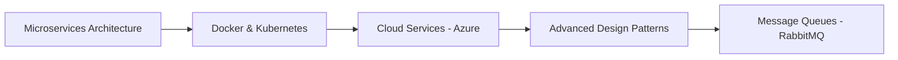

<div align="center">

#  Hey, I'm Ibrahim Taalab


<p>
  <a href="https://www.linkedin.com/in/if0x/">
    
  </a>
  <a href="https://leetcode.com/u/Taalab/">
    
  </a>
  <a href="https://www.facebook.com/XibrahimX9/">
    
  </a>
  <a href="https://www.instagram.com/s_4t2/">
    
  </a>
  <a href="mailto:ibrahimTaala6@gmail.com">
    
  </a>
</p>


📍 Cairo, Egypt | 🎓 BS in Information Systems | 🏆 1st Place ITI Winner

</div>

<br/>


### 🚀 About Me

- 💼 **Backend Engineer** specializing in **ASP.NET Core**
- 🏗️ Passionate about **Clean Architecture** & **Design Patterns**
- 🎯 Building **scalable**, **maintainable** enterprise solutions
- 🌱 Currently exploring **Microservices** & **Docker**
- 💡 Love solving complex problems on **LeetCode**
- 📫 Reach me: **ibrahimTaala6@gmail.com**

<br clear="right"/>

---

## 💻 Tech Stack

<div align="center">

### 🎯 Core Technologies

<p>
  
</p>

### 🛠️ Tools & Frameworks

<p>
  
</p>

### ⚡ Expertise

<table>
<tr>
<td align="center" width="25%">

<br><b>C# & .NET</b>
</td>
<td align="center" width="25%">

<br><b>SQL Server</b>
</td>
<td align="center" width="25%">

<br><b>Docker</b>
</td>
<td align="center" width="25%">

<br><b>Git & GitHub</b>
</td>
</tr>
</table>

</div>

---

## 🎨 Featured Projects

<div align="center">

<table>
<tr>
<td width="50%" valign="top">
  
### 🛒 [E-Commerce API (Talabat)](https://github.com/IF0XY/E-Commerce-API)

Full-featured REST API for online shopping platform

**✨ Features:**
- 🔐 JWT Authentication & Authorization
- 📦 Product Management with Filtering
- 🛍️ Shopping Basket & Orders
- 👨‍💼 Admin Dashboard

**🔧 Tech:**
```
.NET Core | EF Core | SQL Server
Clean Architecture | Repository Pattern
```

</td>
<td width="50%" valign="top">

### 💼 [HR & Payroll System](https://hr-management.tryasp.net/)

Complete HR management solution

**✨ Features:**
- 👥 Employee Management
- 💰 Payroll Processing
- 📊 Attendance Tracking
- 📈 Advanced Reporting

**🔧 Tech:**
```
ASP.NET MVC | Razor | EF Core
N-Tier Architecture | SQL Server
```

**🔗 [Live Demo →](https://hr-management.tryasp.net/)**

</td>
</tr>

<tr>
<td width="50%" valign="top">

### 💪 [Gym Management System](https://github.com/IF0XY/Gym-Management-System)

Gym administration platform

**✨ Features:**
- 🏃 Member & Coach Management
- 📅 Session Scheduling
- 💳 Package Subscriptions
- ✅ Attendance System

**🔧 Tech:**
```
ASP.NET MVC | Identity
Repository Pattern | EF Core
```

</td>
<td width="50%" valign="top">

### 👥 [Employee Management](https://github.com/IF0XY/Employees-Management-System)

CRUD system for organizations

**✨ Features:**
- 🔍 Advanced Search
- ✏️ Create, Edit, Delete Records
- 🏢 Department Management
- 🎨 Intuitive UI

**🔧 Tech:**
```
ASP.NET MVC | Razor Views
Unit of Work | EF Core
```

</td>
</tr>
</table>

</div>

---

## 📊 GitHub Statistics

<div align="center">

<picture>
  <source
    srcset="https://github-readme-stats.vercel.app/api?username=IF0XY&show_icons=true&theme=dark&hide_border=true&count_private=true&bg_color=0d1117&title_color=00D9FF&icon_color=00D9FF&text_color=c9d1d9"
    media="(prefers-color-scheme: dark)"
  />
  <source
    srcset="https://github-readme-stats.vercel.app/api?username=IF0XY&show_icons=true&theme=default&hide_border=true&count_private=true"
    media="(prefers-color-scheme: light)"
  />
  
</picture>

<picture>
  <source
    srcset="https://github-readme-stats.vercel.app/api/top-langs/?username=IF0XY&layout=compact&theme=dark&hide_border=true&bg_color=0d1117&title_color=00D9FF&text_color=c9d1d9&langs_count=8"
    media="(prefers-color-scheme: dark)"
  />
  <source
    srcset="https://github-readme-stats.vercel.app/api/top-langs/?username=IF0XY&layout=compact&theme=default&hide_border=true&langs_count=8"
    media="(prefers-color-scheme: light)"
  />
  
</picture>

<br/><br/>

<picture>
  <source
    srcset="https://streak-stats.demolab.com?user=IF0XY&theme=dark&hide_border=true&background=0d1117&ring=00D9FF&fire=00D9FF&currStreakLabel=00D9FF"
    media="(prefers-color-scheme: dark)"
  />
  <source
    srcset="https://streak-stats.demolab.com?user=IF0XY&theme=default&hide_border=true"
    media="(prefers-color-scheme: light)"
  />
  
</picture>

</div>

---

## 🏆 Achievements & Certifications

<div align="center">

| 🎯 Achievement | 📅 Year | 🏢 Institution |
|:---------------|:--------|:---------------|
| 🥇 **1st Place Team Award** | 2024 | ITI - Full Stack .NET |
| 🎓 **ASP.NET Diploma** | 2025 | Route Academy |
| 💻 **Full Stack Web Development** | 2024 | Information Technology Institute |
| 📜 **ICDL Certificate** | - | Atec Academy |
| 🎓 **BS in Information Systems** | 2025 | Obour Institute (GPA: 3.5) |

</div>

---

## 🌱 Currently Learning

<div align="center">



</div>

---

## 📈 Contribution Activity

<div align="center">

[](https://github.com/IF0XY)

</div>

---

<div align="center">

## 💬 Random Dev Quote


---

### 🤝 Let's Build Something Amazing Together!

<p>


</p>

**⭐ Don't forget to star my repositories if you find them useful!**


</div>
